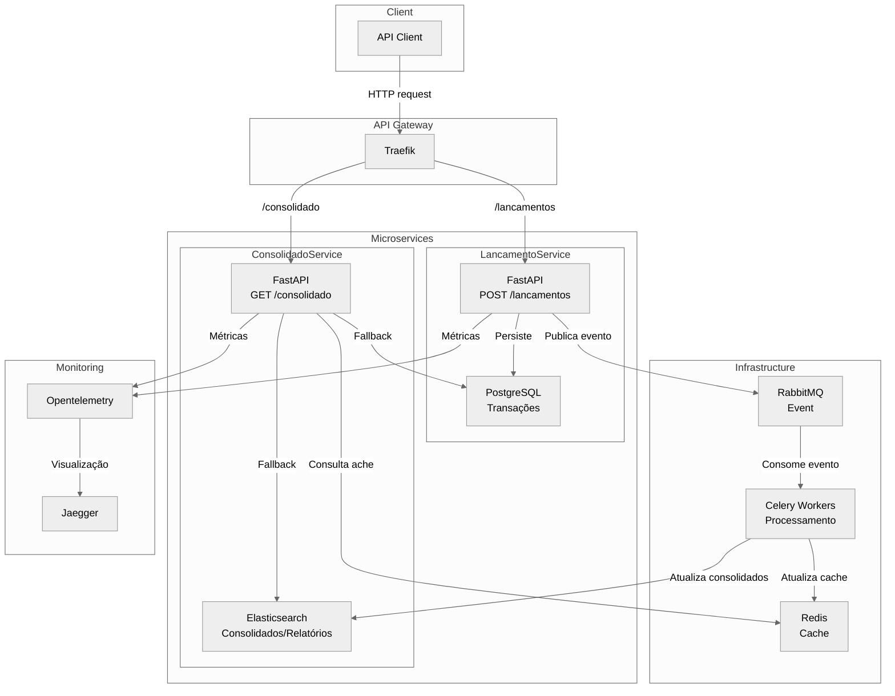
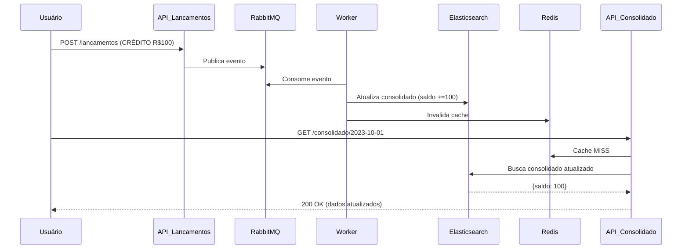

# Desafio Técnico

## Técnologias Utilizadas

O projeto foi construído utilizando Python na versão 3.9 para a construção das APIs com FastAPI. 

#### Banco de Dados:
- PostgreSQL: Escolhido como banco transacional principal devido à sua confiabilidade e suporte a operações de escrita em alta concorrência.
- Elasticsearch: Utilizado para armazenamento e consulta de transações e consolidados. Escolhi ele devido a sua capacidade de consulta e agregações em grade volume de dados.
- Redis: Utilizado para cache das transações.

#### Messageria:
- RabbitMQ: Utilizado para gerencimento da file de processamento.

#### Processamento:

- Celery: Realiza o calculo dos consolidado de forma distribuida com suporte a retry e escalabilidade horizontal.

#### Monitoramento:
- OpenTelemetry:


## Desenho da Aplicação/Arquitetura

A aplicação foi desenvolvida utilizando dois microsserviços independentes: ConsolidadoService e LancamentoService, além de um processador assíncrono responsável por orquestrar a atualização dos dados de forma desacoplada. Esses serviços se comunicam por meio de mensageria assíncrona, adotando a arquitetura orientada a eventos (Event-Driven Architecture), o que garante resiliência, escalabilidade e tolerância a falhas por meio de fallbacks e filas persistentes.

Foram aplicados os princípios da Clean Architecture, que separam claramente as camadas de domínio, infraestrutura e interfaces. Essa estrutura favorece a testabilidade e a manutenção do código, promovendo baixo acoplamento entre os componentes.

A comunicação assíncrona é feita via RabbitMQ, sendo o Celery o responsável por consumir e processar as tarefas em background. Isso permite o desacoplamento entre escrita e leitura dos dados, favorecendo escalabilidade horizontal.

A aplicação adota o padrão CQRS (Command Query Responsibility Segregation), separando claramente os comandos de escrita (gerados pelo LancamentoService) das consultas (realizadas no ConsolidadoService).

Utilizamos Elasticsearch como mecanismo de busca e agregação, proporcionando alta performance para leitura de dados consolidados. O Redis é empregado como cache para reduzir latência nas respostas, sendo invalidado de forma imediata ao receber novos eventos.

A consistência dos dados é garantida de forma eventual (Eventual Consistency): ao receber um novo lançamento, o cache é invalidado imediatamente, e o consolidado é atualizado de forma assíncrona.




## Fluxo


## Executando o Projeto

### Requisitos

- Docker 20.10+
- Docker Compose 2.0+

### Configuração

1. Crie o arquivo `.env`:
```bash
cp .env.example .env
```

2. Configure as variáveis (opcional):
```env
DB_USER=admin
DB_PASSWORD=senhasegura
LOG_LEVEL=DEBUG
```

### Execução dos containers
```bash
# Inicie todos os serviços
docker compose up -d --build

# Execute as migrações
docker exec lancamentos python -m src.scripts.init_db

# Crie índices no Elasticsearch
docker exec lancamentos python -m src.scripts.init_es
```

### Requisições à API

#### 1. Criar Lançamento
POST /lancamentos  
Cria um novo lançamento financeiro (débito/crédito).

```curl
curl --location 'http://localhost:5000/lancamentos' \
--header 'Content-Type: application/json' \
--data '{
    "valor": 150,
    "data": "2025-10-15",
    "descricao": "Venda de produto X",
    "tipo": "CREDITO"
}'
```

*Request:*
```http
POST /lancamentos HTTP/1.1
Content-Type: application/json

{
  "valor": 150.50,
  "tipo": "CREDITO",
  "descricao": "Venda produto X",
  "data": "2025-10-15"
}
```
*Response:*
```http
HTTP/1.1 200 Created
{
  "id": 42,
  "valor": 150.50,
  "tipo": "CREDITO",
  "descricao": "Venda produto X",
  "data": "2025-10-15",
  "created_at": "2025-10-15"
}
```


#### 2. Obter consolidado diario
GET /consolidado/{data}  
Consulta um consoldado por data.

```curl
curl --location 'http://localhost:5001/consolidado/2025-10-15' \
--header 'Content-Type: application/json'
```

*Request:*
```http
GET /consolidado/2025-10-15 HTTP/1.1
Content-Type: application/json
```
*Response:*
```http
HTTP/1.1 200 OK
{
  "data": "2025-10-15",
  "total_creditos": 150.0,
  "total_debitos": 0,
  "saldo_final": 150.0,
}
```

## Observações Finais

Pessoal eu recomecei o projeto do zero e não acabei não tendo tempo de terminar de adicionar nesse o load balance e a autenticação com JWT. Mas eu gostaria de adicionar o seguinte para evoluções futuras:

- Adicionar o load balance.
- Adicionar autenticação JWT para as requisições.
- Adicionar Pattern Outbox caso o rabbitMQ caia, para garantir entrega das mensagens.
- Adicionar Dead-Qeue Letter para mensagens mensagens que não foram processadas corretamente na fila.
- Fallback do consolidado para o Postgre em caso de falha do Redis e Elastic.
- Trocar o rabbit pelo kafka, mas só caso o número de requisições por segundo aumentassem consideravelmente.

Realizei teste de carga com o locust fazendo 500 requisições por segundo e rodou liso, tanto consultando do cache quanto com fallback no elastic.

Obs.: Terminar o código atual seria o ideal também, más.


